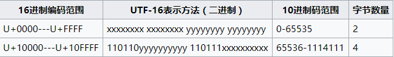
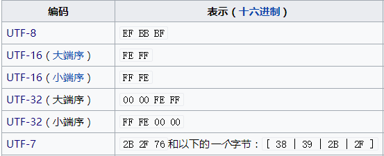
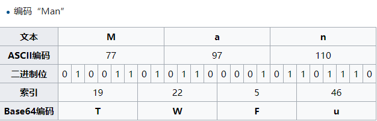

# JavaScript 之 编码✨

在编程中，有接触到一些编码，诸如 ASCII, GBK, GB 2312, Unicode, UTF-8, base64等，对它们的了解是肤浅的，最近有时间去了解他们之间的关系，特此记录下来。

## 字符编码的发展

### [定义-维基](https://zh.wikipedia.org/wiki/%E5%AD%97%E7%AC%A6%E7%BC%96%E7%A0%81)

> 字符编码（英语：Character encoding）、字集码是把字符集中的字符编码为指定集合中某一对象（例如：比特模式、自然数序列、8位组或者电脉冲），以便文本在计算机中存储和通过通信网络的传递。常见的例子包括将拉丁字母表编码成摩斯电码和ASCII。

## ASCII（美国信息交换标准代码）

我们都知道，八比特为一个字节，八比特最多有 2^8 = 256 种状态。计算机发明初期，主要用来显示现代英语，不需要太多字符。所以定义了 128 个字符，其中有 33 个多数为废弃的控制字符，另外 95 个是可显示的字符。128 个字符从 00 - 7F 就足够表示了， 二进制首位都为 0 。比如： 空格 0x20 对应十进制 32， A 0x41 对应十进制 65。更多可以参考 ASCII 表

## EASCII（延伸美国标准信息交换码）

后来扩展版本增加了部分西欧语言的支持，由 ASCII 码由 7 位扩充为 8 位而成。EASCII的 内码是由0到255共有256个字符组成。EASCII 码比 ASCII 码扩充出来的符号包括表格符号、计算符号、希腊字母和特殊的拉丁符号。

## 中文编码

后来计算机开始在其他语言区流行，各个语言区对 ASCII 进行了改造，中国出现了 GB2312, GBK, GB18030，Big5 等。

### GB 2312

对 EASCII 进行改造，去掉了 127 号之后的符号，收录了 6736 个汉字，同时收录了拉丁字母，希腊字母等，并对 ASCII 中存在的字符，数字，字母进行了重新编码，就是我们所说的“全角”字符，127位以下的为“半角”字符。GB2312 基本满足了汉语中常用字的使用，但对繁体字，古汉语中罕见字不能处理。

#### 分区表示

> GB2312 对所收汉字进行了“分区”处理，每区含有94个汉字／符号。这种表示方式也称为区位码。\
> 01–09区为特殊符号。\
> 16–55区为一级汉字，按拼音排序。\
> 56–87区为二级汉字，按部首／笔画排序。

举例来说，“啊”字是GB 2312之中的第一个汉字，它的区位码就是1601。

#### 字节结构

GB 2312 存储通常采用 EUC 存储方法，以便兼容 ASCII。

>每个汉字及符号以两个字节来表示。第一个字节称为“高位字节”，第二个字节称为“低位字节”。\
“高位字节”使用了0xA1–0xF7（把01–87区的区号加上0xA0），“低位字节”使用了0xA1–0xFE（把01–94加上0xA0）。 由于一级汉字从16区起始，汉字区的“高位字节”的范围是0xB0–0xF7，“低位字节”的范围是0xA1–0xFE，占用的码位是72*94=6768。其中有5个空位是D7FA–D7FE。

例如: “啊”字区位码为 1601，在大多数程序中，会以两个字节，0xB0（第一个字节）0xA1（第二个字节）储存。（与区位码对比：0xB0=0xA0+16,0xA1=0xA0+1）。

### GBK

GBK (汉字内码扩展规范)，对GB2312 进行了扩展和兼容

>字符有一字节和双字节编码，00–7F范围内是第一个字节，和ASCII保持一致，此范围内严格上说有96个文字和32个控制符号。\
之后的双字节中，前一字节是双字节的第一位。总体上说第一字节的范围是81–FE（也就是不含80和FF），第二字节的一部分领域在40–7E，其他领域在80–FE。相比 GB2312 增加了更多的位置。

### GB18030

> GB 18030，全称：“国家标准GB 18030-2005《信息技术　中文编码字符集》”，是中华人民共和国现时最新的变长度多字节字符集。对GB 2312-1980完全向后兼容，与GBK基本向后兼容；支持GB 13000（Unicode）的所有码位；共收录汉字70,244个。

#### GB 18030主要有以下特点：

* 采用变长多字节编码，每个字可以由1个、2个或4个字节组成。

* 编码空间庞大，最多可定义161万个字符。

* 支持中国国内少数民族文字，不需要动用造字区。

* 汉字收录范围包含繁体汉字以及日韩汉字。

GB 18030包含三种长度的编码：单字节的ASCII、双字节的GBK（略带扩展）、以及用于填补所有Unicode码位的四字节UTF区段。

## Unicode

Unicode 的出现，是为了解决不同国家编码方式不统一的问题，它对世界上大部分的文字系统进行了整理、编码，使得电脑可以用更为简单的方式来呈现和处理文字。

目前实际应用的统一码版本对应于UCS-2，使用16位的编码空间。也就是每个字符占用2个字节。这样理论上一共最多可以表示216（即65536）个字符。基本满足各种语言的使用。

### 实现方式

Unicode的实现方式不同于编码方式。一个字符的Unicode编码是确定的。在实际传输过程中，由于不同系统平台的设计不一定一致，以及出于节省空间的目的，对Unicode编码的实现方式有所不同。Unicode 的实现方式称为 Unicode 转换格式（Unicode Transformation Format，简称为UTF）。

Unicode 的实现方式包括 UTF-7,UTF-8,UTF-16,UTF-32,GB18030 等，目前通用的实现方式是UTF-16小端序（LE）、UTF-16大端序（BE）和UTF-8。

### UTF-8

UTF-8 是对 Unicode 的可变长度的字符编码。使用一至六个字节为每个字符编码（2003年只能使用原来Unicode定义的区域，U+0000到U+10FFFF，也就是说最多四个字节）

1. 128个 ASCII 字符只需要一个字节编码（Unicode范围由U+0000至U+007F）,ASCII字符范围，字节由零开始

1. 带有附加符号的拉丁文、希腊文、西里尔字母、亚美尼亚语、希伯来文、阿拉伯文、叙利亚文及它拿字母则需要两个字节编码（Unicode范围由U+0080至U+07FF），第一个字节由110开始，接着的字节由10开始

1. 其他基本多文种平面（BMP）中的字符（这包含了大部分常用字，如大部分的汉字）使用三个字节编码（Unicode范围由U+0800至U+FFFF），第一个字节由1110开始，接着的字节由10开始

1. 其他极少使用的Unicode 辅助平面的字符使用四至六字节编码，将由11110开始，接着的字节由10开始

### UTF-16

Unicode字符的码位，需要1个或者2个16位长的码元来表示，即两个字节和四个字节表示。也是一种变长的字符编码。

1. **从U+0000至U+D7FF以及从U+E000至U+FFFF的码位**\
    第一个Unicode平面包含了最常用字符，该平面被称为基本多语言平面，缩写为BMP。

1. **从U+10000到U+10FFFF的码位**\
  辅助平面（Supplementary Planes）中的码位，在UTF-16中被编码为一对16比特长的码元（即32bit,4Bytes），称作代理对（surrogate pair）

  >* 码位减去0x10000,得到的值的范围为20比特长的0..0xFFFFF.
  >* 高位的10比特的值（值的范围为0..0x3FF）被加上0xD800得到第一个码元或称作高位代理（high surrogate），值的范围是 *0xD800..0xDBFF*.由于高位代理比低位代理的值要小，所以为了避免混淆使用，Unicode标准现在称高位代理为**前导代理**（lead surrogates）。
  >* 低位的10比特的值（值的范围也是0..0x3FF）被加上0xDC00得到第二个码元或称作低位代理（low surrogate），现在值的范围是 *0xDC00..0xDFFF*.由于低位代理比高位代理的值要大，所以为了避免混淆使用，Unicode标准现在称低位代理为**后尾代理**（trail surrogates）。

1. **从U+D800到U+DFFF的码位**\
    Unicode标准规定U+D800..U+DFFF的值不对应于任何字符

#### UTF-16与UCS-2的关系

  UTF-16可看成是UCS-2的父集。在没有辅助平面字符前，UTF-16与UCS-2所指的是同一的意思。但当引入辅助平面字符后，就称为UTF-16了。现在若有软件声称自己支持UCS-2编码，那其实是暗指它不能支持在UTF-16中超过2字节的字集。对于小于0x10000的UCS码，UTF-16编码就等于UCS码

### BOM

字节顺序标记（英语：byte-order mark，BOM），是位于码点U+FEFF的统一码字符的名称。通常用来标示编码的字节序。

字符U+FEFF，如果出现在字节流的开头，则用来标识该字节流的字节序，是高位在前还是低位在前。主要由于不同系统对字节顺序的处理方式不一致，如一个字符十六进制编码为4E59，按照两个字节拆为 4E 和 59，MAC 读取是从低字节开始读取，就变成了594E，然后再查找对应字符。而 windows 则从高字节读取。这就凸显字节顺序的重要。因此有了大端序（Big-Endian）和小端序（Little-Endian）。字节0xFE和0xFF在UTF-8编码中从未用到，则没有字节顺序。UTF-8编码过的字节顺序标记则被用来标示它是UTF-8的文件，因此不需要BOM

BOM 可以通过 [UE](https://www.ultraedit.com/) 和 [winHex](http://www.winhex.com/winhex/hex-editor.html) 以二进制方式打开对应编码的文件看到 文件最开始的 BOM。

### Base64

Base64是一种基于64个可打印字符来表示二进制数据的表示方法。六个比特作为一个单元，所以三个字节对应四个 Base64 单元。在 Base64 中可打印字符包括字母A-Z、a-z、数字0-9 和两个可打印符号（在不同的系统中而不同）。

Unicode 字节数不能被 3 整除时，用0字节值补够足，然后再进行 Base64 编码，在其后补一到两个 ‘=’代表补足的字节数。

## JavaScript 中的编码

JavaScript 采用 Unicode字符集，但只支持 16 位 UTF 编码。由于历史原因语言层面是采用 USC-2 ，可以参考下面的链接。由此造成了对多字节 Unicode 长度识别不准确。

### JavaScript 编码函数

* *enCodeURI & deCodeURI*

  enCodeURI() 是对统一资源标识符（URI）进行编码的方法， 会替换所有的字符，但不包括以下字符 ; , / ? : @ & = + $ 字母 数字 - _ . ! ~ * ' ( ) #

  decodeURI() 函数解码一个由encodeURI 先前创建的统一资源标识符（URI）或类似的例程

* *enCodeURIComponent & deCodeURIComponent*

  enCodeURIComponent() 是对统一资源标识符（URI）的组成部分进行编码的方法,它使用一到四个转义序列来表示字符串中的每个字符的UTF-8编码， 转义除了字母、数字、(、)、.、!、~、*、'、-和_之外的所有字符。**（会转义enCodeURI不转义的 ; , / ? : & = + $ #）**

  decodeURIComponent() 方法用于解码由 encodeURIComponent 方法或者其它类似方法编码的部分统一资源标识符（URI）

* *btoa & atob*

  btoa -- 将ascii字符串或二进制数据转换成一个base64编码过的字符串,该方法不能直接作用于Unicode字符串.

  atob -- 解码一个已经被base-64编码过的数据

* *escape & unescape (*已废弃*)*

* *String.fromCharCode & String.prototype.charCodeAt*

  String.fromCharCode() 方法返回使用指定的Unicode值序列创建的字符串

  charCodeAt() 方法返回0到65535之间的整数，表示给定索引处的UTF-16代码单元 (在 Unicode 编码单元表示一个单一的 UTF-16 编码单元的情况下，UTF-16 编码单元匹配 Unicode 编码单元。但在——例如 Unicode 编码单元 > 0x10000 的这种——不能被一个 UTF-16 编码单元单独表示的情况下，只能匹配 Unicode 代理对的第一个编码单元)

* *String.fromCodePoint & String.prototype.codePointAt*

  String.fromCodePoint() 静态方法返回使用指定的代码点序列创建的字符串。

  codePointAt() 方法返回 一个 Unicode 编码点值的非负整数。如果在指定的位置没有元素则返回 undefined 。如果在索引处开始没有UTF-16 代理对，将直接返回在那个索引处的编码单元。

## 参考

* [ASCII](https://zh.wikipedia.org/wiki/ASCII)

* [Unicode](https://zh.wikipedia.org/wiki/Unicode)

* [UTF-8](https://zh.wikipedia.org/wiki/UTF-8)

* [Base64](https://zh.wikipedia.org/wiki/Base64)

* [Unicode and JavaScript](http://2ality.com/2013/09/javascript-unicode.html)

* [JavaScript’s internal character encoding: UCS-2 or UTF-16?](https://mathiasbynens.be/notes/javascript-encoding)

* [JavaScript has a Unicode problem](https://mathiasbynens.be/notes/javascript-unicode)

* [Unicode与JavaScript详解](http://www.ruanyifeng.com/blog/2014/12/unicode.html)